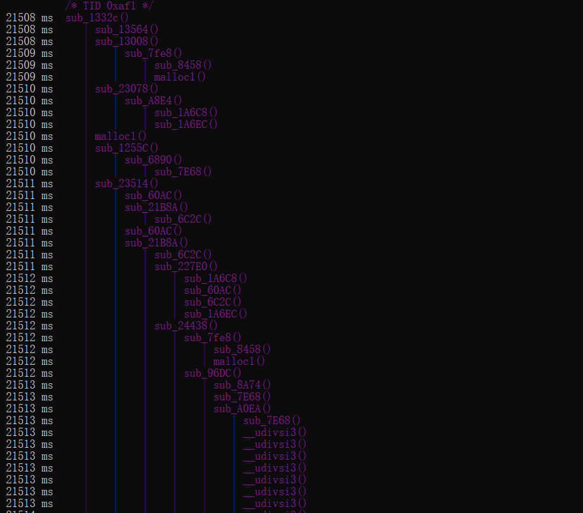

# trace_natives

一个IDA小脚本，使用frida-trace 批量trace so函数的调用。

## 0.使用方法

1.将traceNatives.py丢进IDA plugins目录中

2.替换本地frida-tools包中的tracer.py和tracer_agent.js

3.IDA中，Edit-Plugins-traceNatives

效果



## 1.缘由

和朋友在分析android so的时候，他感慨了一句，“唉，要是能捋清整个流程就好了”。确实，搞清楚流向的件挺重要的事，只要代码复杂一些，函数多一些，分支多一些，通过函数指针跳转多一些……不管哪一个多一些，静态分析SO就会变得十分恼人。

得益于Frida布道师@r0ysue以及看雪Android逆向课程的大力推广，近来入门Android逆向的技术人员，个个都用上了Frida以及其工具套件，生产力大大提高。Java层的Objection+Frida一梭子，已经非常快乐的替代了Xposed的位置，而且效率翻了很多倍。而在Native层，情况不太一样，[JNItrace](https://github.com/chame1eon/jnitrace)是一个非常棒的工具，让JNI操作一览无余。Frida Hook也依然优雅，几行代码就可以根据偏移地址Hook打印输出，但native代码稍微有些复杂的时候，还是觉得有些力不从心，但能不动态调试还是不想用IDA动态调试，因为觉得动态调试比Frida麻烦多了。

所以我就想能不能用frida做一个SO函数的批量Hook，减少一部分使用IDA动态调试的需求。


## 2.思路

想法很简单

* 使用idapython编写脚本得到代码段中所有函数的偏移地址
* 编写Frida脚本批量Hook

步骤一很顺利，用api处理了两个小细节

* 如果函数名被c++命名粉碎过，还原一下函数名，不然看起来怪难受的。
* Thumb模式下地址+1

步骤二遇到了问题，批量Hook几百个函数，APP很容易崩溃，除此之外，打印效果也不算很好。

所以开始想办法优化，一是只打印汇编指令长度大于10条的函数，trace嘛，抓住主线就行了，如果在你的手机/APP环境下还会崩溃，可以修改代码增高限制。而打印效果不好的问题，我偷了个懒，咳咳。Frida-trace是Frida 的官方Trace工具，随者它不断更新，越来越强大，但大家对它的关注度一直不太高，其实可以好好挖一下der。

下面例举几种用处

批量HOOK Java方法，支持正则表达式模糊匹配。

```powershell
frida-trace -UF -j '*!*certificate*/isu'
```

Hook 所有静态注册的JNI函数

```
frida-trace -UF -i "Java_*"
```

Hook 未导出函数

```powershell
frida-trace -UF -a "libjpeg.so!0x4793c"
```

我们就是要使用最后这种，同时白嫖它的trace和排版。

```powershell
frida-trace -UF -a "libjpeg.so!0x4793c" -a "libjpeg.so!0x227c" -a "libjpeg.so!0x9193" -a xxx
```

但是这样做的话，命令实在是太长了，如果有几百个待Hook的函数地址，windows上甚至超过限定的命令行长度。除此之外，Frida-trace显示函数地址的方式是“sub_Hook地址”，因为Thumb模式下要+1的缘故，所以Frida trace中“sub_123C”在IDA中显示是“sub_123B”，看着怪别扭的，所以对Frida-trace的python脚本和js脚本都稍做微调，就搞定啦，这也是为啥要替换掉原来的tracer.py以及tracer_agent.js的原因。
